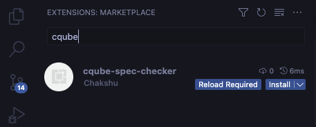
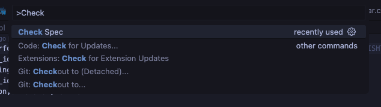
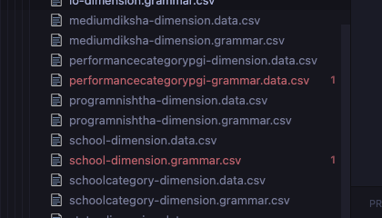
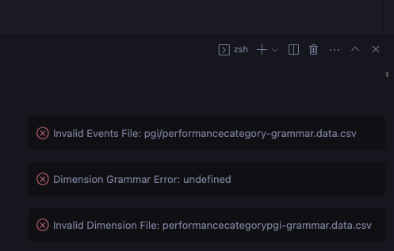
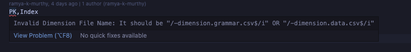
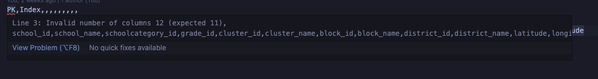
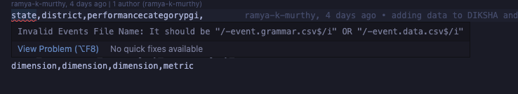

# cqube-spec-checker README

This allows for verifying the cQube Grammar and Syntax.

## Installation
Search for cQube in the extensions tab and install.

## Usage
Run the command `CQube: Verify Spec` from the command palette.

### Example of Errors Highlighted
You should see the errors highlighted in the sidebar and in the editor.

### Example of Errors as Nofication

### Error Details in Files

## Release Notes
### 0.0.1
Initial release of cqube-spec-checker. Highlights the files with wrong names in the ingest folder.

### 0.0.4
- Verify File Name
- Verify Dimension Grammar Schema
- Verify Dimension Grammar to Data Mapping